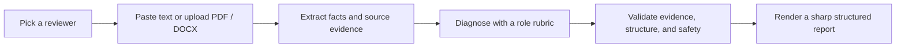

<p align="center">
  
</p>

<div align="center">

# Bie Ma Le · 别骂了

**Remove the pleasantries. Keep only what must be fixed.**

An evidence-grounded AI critique engine wrapped in a deliberately sharp WeChat Mini Program.

**English** · [简体中文](README.zh-CN.md) · [Product framework](docs/product-framework.md) · [Deployment](docs/cloudbase-deployment.md) · [Contributing](CONTRIBUTING.md)

[](https://github.com/chenzhiyong1994/bie-ma-le/actions/workflows/ci.yml)
[](LICENSE)


</div>

> This is not a chatbot that throws random insults. A professional rubric makes the diagnosis; the character layer only makes the delivery impossible to ignore.

## What makes it different

Every important finding must answer four questions: **Where is the evidence? Why does it matter? How should it be fixed? What does “done” look like?**

| Generic AI feedback | Bie Ma Le |
| --- | --- |
| “Be more specific” | Quotes the source and names the missing fact or metric |
| A flat list of suggestions | Keeps 0–3 clustered issues and assigns severity |
| Explains what is wrong | Adds an executable rewrite structure and acceptance checks |
| Finds flaws to look smart | Allows zero issues when the material is genuinely strong |
| Mixes persona with judgment | Separates professional diagnosis, rendering, validation, and safety |

## Four reviewers, one contract

- **Resume Tyrant** — positioning, outcomes, credibility, reading efficiency
- **Report Tyrant** — conclusions, business value, evidence, decision requests
- **Copy Tyrant** — audience, hook, proof, conversion
- **Product Tyrant** — problem evidence, solution fit, prioritization, acceptance boundaries

All four use the same role registry, structured report protocol, evidence checks, and safety rules. Adding a reviewer means adding a real rubric and evaluation cases—not just a new avatar.



## Privacy model

- Materials and reports are exchanged through short-lived private CloudBase files; cloud-function events carry random file IDs instead of plaintext.
- PDF / DOCX content is parsed in memory. Inputs and result files are deleted after consumption.
- Materials, reports, and tasks are not persisted to a database.
- Share payloads never contain source material, quotations, scores, or report content.
- Uploaded material is untrusted input and cannot override the system or role contract.

See the [review API contract](docs/api/review-api.md) for the exact data flow. Re-evaluate the lifecycle against your own cloud environment and compliance requirements before deploying a fork.

## Quick start

Requirements: Node.js 20.19+, WeChat DevTools, and a CloudBase environment with an enabled AI model.

```bash
git clone https://github.com/chenzhiyong1994/bie-ma-le.git
cd bie-ma-le
npm ci
npm run check
```

Then import the repository into WeChat DevTools with your own AppID, set your CloudBase environment in `apps/miniprogram/config/cloud.js`, build with `npm run build:cloud`, and follow the [deployment guide](docs/cloudbase-deployment.md).

Do not commit real AppIDs, environment IDs, credentials, `.env` files, or user material. Public configuration in this repository contains placeholders only.

## Repository map

```text
apps/miniprogram/        Native WeChat Mini Program
services/cloud-function/ Production CloudBase function source
services/api/            Local test/debug adapter
packages/ai-core/        Roles, diagnosis, rendering, and safety validation
evals/                   Cross-role quality evaluations
tests/                   Sanitized fixtures and integration tests
docs/                    Product, API, deployment, and architecture decisions
```

## Contributing

Reproducible bugs, new evaluation cases using synthetic or thoroughly sanitized material, and focused pull requests are welcome. Please read [CONTRIBUTING.md](CONTRIBUTING.md) and [SECURITY.md](SECURITY.md) first.

This project is built by a product owner working alongside Codex. AI-assisted contributions are welcome, but contributors remain responsible for understanding and validating their final changes.

## License

Code and original repository assets are available under the [MIT License](LICENSE). Disclose the source and usage rights of any third-party or model-generated asset included in a contribution.
