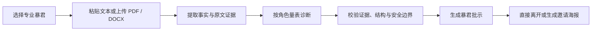
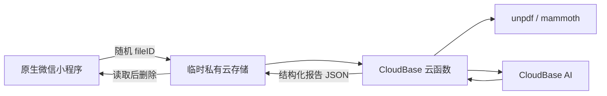

<p align="center">
  
</p>

<div align="center">

# 别骂了

**把客套话删掉，只留下你必须修的问题。**

一个会引用证据、解释影响、给出修改方案和验收标准的 AI 材料评审微信小程序。

[English](README.md) · **简体中文** · [产品框架](docs/product-framework.md) · [部署指南](docs/cloudbase-deployment.md) · [参与贡献](CONTRIBUTING.md)

[](https://github.com/chenzhiyong1994/bie-ma-le/actions/workflows/ci.yml)
[](LICENSE)


</div>

> 不是“随机骂两句”的聊天机器人。它先按专业量表诊断，再让角色负责把话说得足够直接。

## 为什么做这个项目

普通反馈经常卡在两端：朋友怕伤感情，只会说“挺好的”；通用 AI 列出十几条正确但无关痛痒的建议，却不肯判断哪一条最致命。

“别骂了”尝试把一次评审变成可以验收的交付：每个重要问题都必须回答四件事——**证据在哪里、为什么有影响、具体怎么改、改到什么程度算过关**。角色可以尖锐，判断不能随意。

| 常见反馈 | “别骂了”的做法 |
| --- | --- |
| 泛泛说“可以更具体” | 引用原文，指出缺了哪个事实或数字 |
| 给一长串平级建议 | 只保留 0–3 个聚类问题，明确 P0 / P1 / P2 |
| 只告诉你哪里不好 | 给出可直接套用的结构、执行顺序和验收条件 |
| 为了显得专业强行挑错 | 好材料允许零问题，成立的优势也必须有证据 |
| 把角色设定直接塞进 Prompt | 专业诊断与角色表达分层，统一做结构与安全校验 |

## 四位正在值班的暴君

<table>
  <tr>
    <td align="center" width="25%"><br/><strong>简历暴君</strong><br/><sub>定位 · 成果 · 可信 · 效率</sub></td>
    <td align="center" width="25%"><br/><strong>汇报暴君</strong><br/><sub>结论 · 价值 · 证据 · 决策</sub></td>
    <td align="center" width="25%"><br/><strong>文案暴君</strong><br/><sub>受众 · 钩子 · 利益 · 转化</sub></td>
    <td align="center" width="25%"><br/><strong>产品暴君</strong><br/><sub>证据 · 逻辑 · 取舍 · 边界</sub></td>
  </tr>
</table>

四个角色共用一套角色注册表、结构化报告协议和安全边界。新增角色不是换头像和口头禅，而是补齐一套新的专业量表、样例和评测集。

## 一次评审是怎么完成的



报告按材料质量分为 `critical`、`rebuilding`、`ready`，并稳定输出：

- 一句整体判决与四项角色专属评分；
- 0–3 条有原文依据的可保留优势；
- 0–3 个按严重度排序的聚类问题；
- 每个问题对应的证据、影响、修改步骤与至少两项可核验标准。

项目刻意保持“一次性体验”：不建立历史记录，不伪造“比上一版更好”的连续性，也不把一次评审包装成需要长期维护的任务系统。

## 架构与隐私边界



- 文件、目标背景与报告不直接进入云函数 Event 或返回日志；事件只传随机文件标识。
- PDF / DOCX 在云函数内存中解析，输入与输出临时文件在消费后删除。
- 材料、报告和任务不写数据库；分享载荷不包含材料、证据、分数或报告正文。
- 用户材料只作为待评对象，不得覆盖系统规则；角色表达只攻击作品和可改变行为。
- 当前不支持扫描版 PDF、旧版 `.doc`、登录、历史记录和连续复审。

完整协议见 [多角色评审与材料 API](docs/api/review-api.md)。部署自己的实例前，请按你的云环境与合规要求重新核验数据生命周期。

## 快速开始

### 1. 准备环境

- Node.js 20.19 或更高版本
- 微信开发者工具
- 已开通 AI 能力的微信云开发环境

### 2. 安装与验证

```bash
git clone https://github.com/chenzhiyong1994/bie-ma-le.git
cd bie-ma-le
npm ci
npm run check
```

`npm run check` 会构建云函数、校验小程序配置并运行 AI 核心与本地 Adapter 的测试，不会调用付费模型。

### 3. 使用你自己的云环境

1. 用微信开发者工具导入仓库，选择你自己的小程序 AppID。
2. 将 `apps/miniprogram/config/cloud.js` 中的 `environmentId` 改为你的云开发环境 ID；单环境调试也可以保留为空。
3. 将 `cloudbaserc.json` 的占位环境 ID 改为你自己的值，或在 CLI 命令中显式传入 `--env-id`。
4. 运行 `npm run build:cloud`，再按 [云开发部署指南](docs/cloudbase-deployment.md) 部署 `bml-api-v2`。

不要提交真实 AppID、环境 ID、本地 `.env`、SecretId、SecretKey 或真实用户材料。仓库中的公开配置只包含占位值；`.env.example` 仅说明变量名。

## 常用命令

| 命令 | 用途 | 是否调用真实服务 |
| --- | --- | --- |
| `npm run check` | 完整本地校验 | 否 |
| `npm run test:api` | AI 核心与 Adapter 测试 | 否 |
| `npm run check:miniprogram` | 小程序结构与配置校验 | 否 |
| `npm run build:cloud` | 生成云函数部署产物 | 否 |
| `npm run check:provider` | 检查本地云开发 AI 配置 | 是 |
| `npm run smoke:review` | 发起一次真实评审冒烟测试 | 是 |

只有在 `.env` 已配置你自己的环境与凭据、且明确接受一次真实模型调用时，才运行最后两项。

## 仓库结构

```text
apps/miniprogram/        原生微信小程序
services/cloud-function/ CloudBase 生产云函数源码
services/api/            本地测试与调试 Adapter
packages/ai-core/        角色包、诊断、渲染与安全校验
evals/                   多角色质量评测目录
tests/                   跨模块与脱敏测试材料
docs/                    产品、API、部署与架构决策
assets/                  品牌与项目介绍素材
```

## 当前状态与路线

当前仓库已经跑通四角色、文本与 PDF / DOCX 输入、结构化报告、临时文件协议和分享海报，是一个持续迭代中的产品型开源项目。

接下来优先做：

- 用更多脱敏样例扩大四角色质量评测；
- 补齐真实设备上的文件兼容性与失败恢复验证；
- 根据实际使用数据决定下一批角色，而不是先堆数量；
- 探索自定义角色编译器，同时保持 Prompt 注入与表达边界。

路线与边界以 [产品框架](docs/product-framework.md) 和 [架构决策记录](docs/decisions/README.md) 为准。

## 参与项目

如果你也在研究 AI 评审、结构化生成、微信云开发或“怎样让反馈更直接但不越界”，欢迎：

- 在 [Issues](https://github.com/chenzhiyong1994/bie-ma-le/issues) 提交可复现问题或具体场景；
- 用**虚构或充分脱敏**的材料补充评测案例；
- 为角色量表、文件解析、隐私协议和小程序体验提交 PR；
- 先阅读 [贡献指南](CONTRIBUTING.md) 与 [安全政策](SECURITY.md)。

这个项目由产品负责人和 Codex 结对推进。我们欢迎 AI 辅助贡献，但提交者仍需理解、验证并为最终改动负责。

## 许可证

代码与仓库内原创素材采用 [MIT License](LICENSE)。如你的贡献包含第三方素材或模型生成资产，请在 PR 中说明来源、授权和使用限制。
