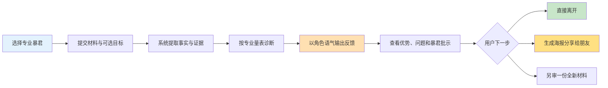
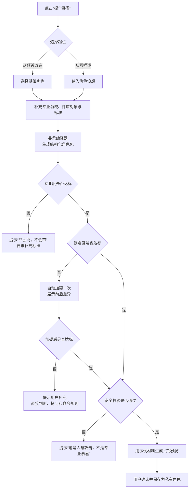
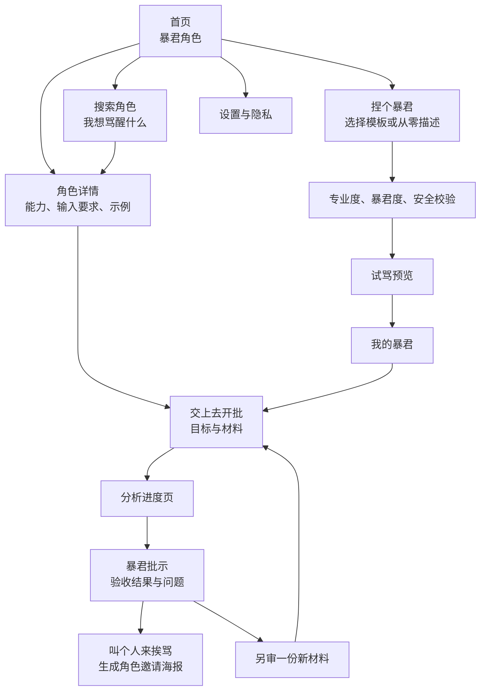
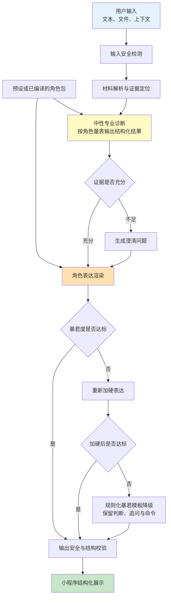
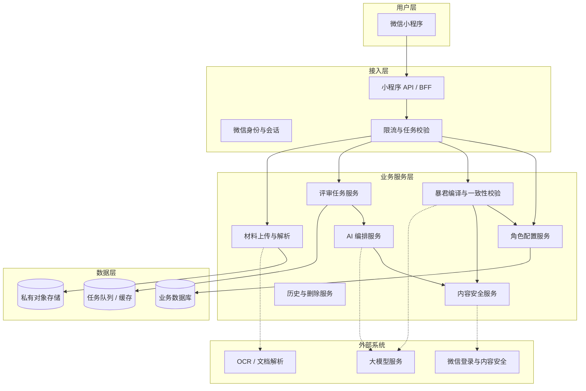
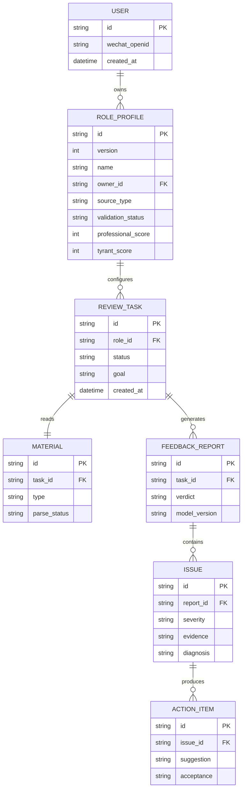
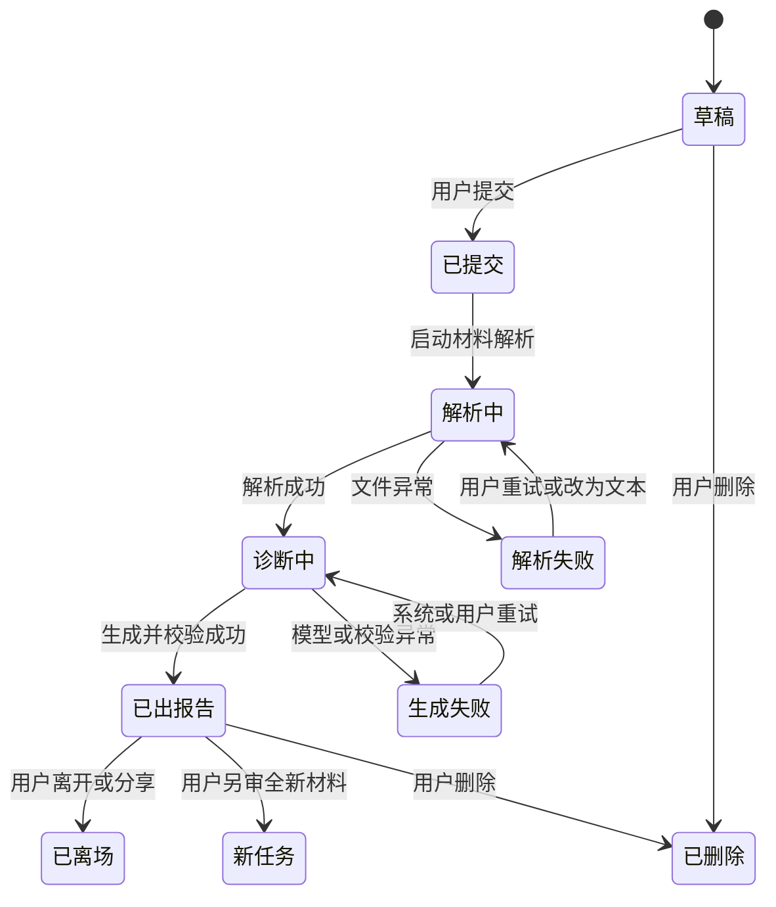
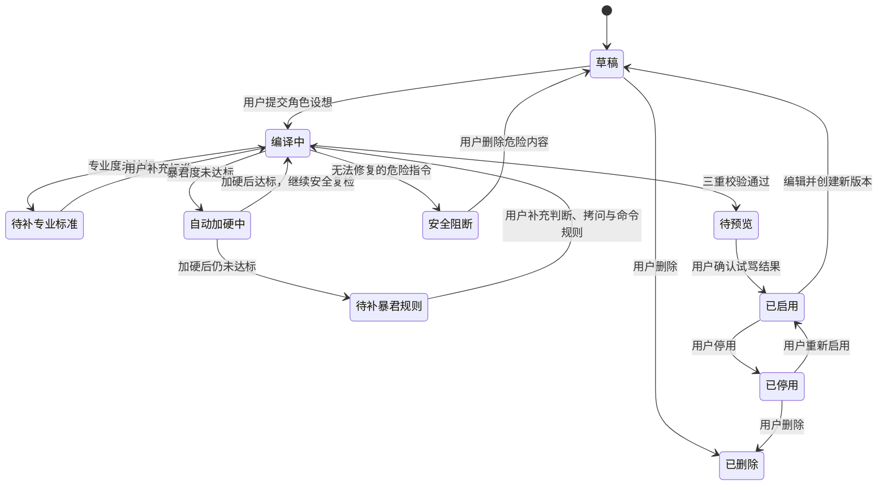

# “暴君别骂了”微信小程序初步产品框架

初版日期：2026-07-14

最近更新：2026-07-28

阶段：0-1 产品框架 / 开发前定义

微信认证名称：暴君别骂了

产品简称：别骂了

核心传播钩子：暴君批示

## 0. 一句话结论

“暴君别骂了”（产品简称“别骂了”）不是一个以辱骂为卖点的聊天机器人，而是一个用极强角色表达包装的专业诊断工具：用户提交作品或问题，系统引用具体证据指出最致命的问题，并为每个问题给出对应修改建议和验收标准。

推荐传播语：**直面暴君，看你交的东西能不能过。**

产品价值口号：**把客套话删掉，只留下你必须修的问题。**

## 1. 第一性原理

### 1.1 用户真正需要的不是“被骂”

用户选择暴君角色，表层需求是刺激、爽感和传播性，深层需求通常是：

1. 普通 AI 反馈过于客气、空泛，不敢明确判断好坏。
2. 用户不知道自己的材料为什么无效，也不知道最先应该修改什么。
3. 用户需要一个具有专业权威感的外部视角，打破自我合理化。
4. 用户希望反馈既足够直接，又能转化为下一步行动。

因此，产品价值的优先级应为：

> 专业判断准确性 > 问题证据充分性 > 行动可执行性 > 角色冲击力 > 娱乐性

### 1.2 不可删减的单次体验

产品刻意保持“随到随用、用完即走”。一次体验必须在单次会话内交付完整价值：



单次体验的最小结果不是“用户看完一段狠话”，而是“用户知道哪些内容站得住、最致命的问题是什么、该怎么救”，然后可以毫无负担地离开。分享承接传播，不把用户拉进连续任务。

### 1.3 产品设计原则

| 原则 | 产品含义 |
| --- | --- |
| 专业上攻击作品，不攻击用户智力或人格 | 作品级狠词不设数量配额，也不作为报告通过条件；始终禁止“你是废物”“你不配活”等人格否定和危险表达 |
| 每次定罪必须有证据 | 每个重要问题都要引用原文、用户回答或缺失信息 |
| 先判优先级，再追求全面 | 首屏只展示 0-3 个聚类问题；同类缺陷可收纳多段证据，不输出无穷清单 |
| 好坏判断都必须可证明 | 正面评价同样引用原文，告诉用户哪些内容已成立、修改时应保留什么 |
| 狠话后面必须跟行动 | 每个批评在同一问题中关联具体修改步骤、可套用结构和两项以上可核验验收条件 |
| 不知道就审问，不允许编造 | 信息不足时明确指出缺口，并要求用户补充证据 |
| 角色是表达层，专业量表是内核 | 人设可以扩展，诊断协议必须稳定、可测试 |
| 每份材料互不相认 | 不建立上一版或下一轮，不用“这次终于”“比上次”等虚构连续性措辞 |
| 分享体验，不分享隐私 | 分享只带角色和情绪钩子，不带材料、证据、分数或报告正文 |

## 2. 产品定位与边界

### 2.1 品牌命名与传播语言

产品名需要像一句用户会脱口而出、愿意截图转发的话，而不是一个功能分类名。

| 名称 | 传播力 | 产品契合度 | 风险 | 建议用途 |
| --- | --- | --- | --- | --- |
| **暴君别骂了** | 高，同时交代角色世界观与对话反差 | 高，用户明知会面对暴君仍主动进入 | 名称已通过平台认证，界面内可继续使用简称“别骂了” | **微信认证名称** |
| **暴君批示** | 高，直接承接角色世界观和结果页 | 高，适合报告和分享场景 | 需要靠专业证据避免只剩角色表演 | **推荐作为核心功能名和传播钩子** |
| 骂醒我 | 中高，价值清楚 | 中高，更偏自我激励 | 梗感略弱，容易变成普通成长工具 | 备选产品名 |
| 先挨骂 | 中高，行动感强 | 中高，符合随到随用 | 难承载复杂任务体系，但当前不需要 | 备选活动名 |

推荐采用“双层品牌结构”：

- **微信认证名称**：暴君别骂了
- **产品简称**：别骂了
- **平台介绍**：把简历、汇报、文案和产品方案交给暴君。它像一个尖酸刻薄的直属领导，不说客套话，只凭证据拆穿空话、解释影响，并给出能直接照做的修改命令。
- **小程序头像**：[144×144 PNG](../assets/brand/baojun-bie-ma-le-logo-144.png)
- **一句话传播语**：直面暴君，看你交的东西能不能过
- **核心结果页**：暴君批示
- **预设角色入口**：选个暴君
- **自定义角色入口**：捏个暴君
- **提交按钮**：交上去，开批
- **分享入口**：生成暴君邀请图
- **新材料入口**：再审一份新的

“暴君”承担统一世界观：用户把工作交给一位尖酸刻薄、不留情面的直属领导，接受反问、冷嘲、逐条挑刺和明确改令。语言应像真实评审会，不像客服，也不像古装官署；专业证据与验收线负责保证角色不是只会骂人的空壳。“暴君别骂了”承载平台认证名称，“别骂了”保留为界面内的短称和一次性评审入口。

### 2.2 产品定位

面向需要快速判断简历、产品方案、汇报和文案质量的个人用户，提供“高压角色化、证据化、可执行”的一次性 AI 评审体验。

### 2.3 目标用户与场景

| 用户 | 典型场景 | 当前痛点 |
| --- | --- | --- |
| 求职者 | 修改简历、准备投递 | 反馈客气，无法判断简历为什么过不了筛选 |
| 职场人士 | 汇报、晋升、述职、会议表达 | 身边人碍于关系，不会直接指出表达和成果漏洞 |
| 产品经理与创业者 | 评审需求、PRD、产品方案、创业计划 | 容易自证合理，缺少冷酷的逻辑压力测试 |
| 内容创作者 | 文案、选题、PPT、视频脚本、小说 | 常规 AI 只会润色，不敢判断内容是否无聊或无效 |
| 学生与研究者 | 作文、论文、答辩、备考计划 | 得到的反馈滞后、笼统，缺少针对性追问 |
| 开发者与技术人员 | 代码、架构、技术方案、故障复盘 | 工具关注语法正确，缺少对设计质量和工程风险的尖锐评审 |
| 个人计划制定者 | 预算、日程、旅行和执行计划 | 计划容易自我感动，却没有现实约束和失败预案 |

### 2.4 本阶段明确不做

1. 不做支付、会员、积分或商业化体系。
2. 不做角色社区、用户投稿、排行榜和公开广场。
3. 不允许用户原始 Prompt 直接成为系统 Prompt；自定义角色必须经过结构化编译与校验。
4. MVP 不做公开发布、交易或分享他人创建的自定义暴君。
5. 不做语音、视频、3D 角色或复杂动画。
6. 不做医疗、心理诊断、法律判断等高风险专业角色。
7. 不把用户材料默认公开，也不默认用于训练模型。
8. 不做修改版复审、历史任务、连续对话和需要用户维护的成长档案。

## 3. 角色系统

### 3.1 角色不是一段 Prompt，而是一份“角色包”

每个角色由四层组成：

| 层级 | 定义 | 示例 |
| --- | --- | --- |
| 专业身份层 | 角色是谁、服务什么结果 | 硅谷 VC 简历筛选官 |
| 诊断量表层 | 用什么维度和证据判断 | 定位、结果、可信度、表达效率 |
| 表达风格层 | 允许使用怎样的语言强度 | 冷酷、短句、反问、命令式 |
| 输出协议层 | 最终必须输出哪些结构 | 判决、评分、证据化问题、对应改法 |

后续新增角色时，应优先编写诊断量表和测试样例，再编写人设文案。

### 3.2 角色包建议字段

| 字段 | 说明 |
| --- | --- |
| `role_id` / `version` | 角色唯一标识与版本，保证当前报告生成行为可复现 |
| `source_type` / `owner_id` | 区分平台预设与用户自定义；自定义角色记录所属用户 |
| 名称、头像、宣言 | 前端展示信息 |
| 适用场景 | 用户什么时候应该选择该角色 |
| 输入要求 | 支持的材料类型、必填背景、可选目标 |
| 诊断维度 | 维度名称、权重、判断规则、反例 |
| 追问策略 | 信息不足或逻辑断裂时如何继续拷问 |
| 语气规则 | 可用表达、句式、强度上限 |
| 禁止规则 | 不允许出现的人格贬损、威胁或危险建议 |
| 一致性评分 | 专业度、暴君度和安全校验结果 |
| 输出结构 | 稳定的 JSON 字段与展示模块 |
| 测试集 | 优秀、普通、极差和边界材料的期望判断 |

### 3.3 预设暴君角色库

角色库按用户要解决的问题分组，不按 AI 技术能力分组。以下先规划 25 个候选角色；首页最多展示六个场景分类，用户也可以直接搜索角色或输入“我想骂醒什么”。

| 场景分类 | 暴君角色 | 主要输入 | 核心任务 | 版本 |
| --- | --- | --- | --- | --- |
| 求职职场 | 简历暴君 | 简历、可选完整 JD | 无目标时审整体质量，有目标时审 JD 匹配证据 | P0 |
| 求职职场 | 面试暴君 | 简历、岗位、用户回答 | 压力追问并拆穿空话、背稿和逻辑漏洞 | P0 |
| 求职职场 | 汇报暴君 | 汇报稿、周报、述职材料 | 追问结论、真实贡献、业务价值和决策请求 | P0 |
| 求职职场 | 晋升暴君 | 晋升材料、成果清单、职级要求 | 判断材料证明的是苦劳、功劳还是更高职级能力 | P1 |
| 产品创业 | 产品暴君 | 产品想法、PRD、数据背景 | 拆解伪需求、逻辑断裂、无效功能和异常缺口 | P0 |
| 产品创业 | 需求暴君 | 需求池、功能列表、用户反馈 | 打回无价值需求，逼问优先级和验收指标 | P1 |
| 产品创业 | 创业暴君 | 创业想法、用户与方案 | 找出项目最危险的假设和成本黑洞 | P1 |
| 产品创业 | 商业计划暴君 | 商业计划书、路演稿 | 压测增长、成本、壁垒和关键假设 | P2 |
| 内容创作 | 文案暴君 | 广告文案、社媒内容、标题 | 判断钩子、受众利益和行动转化，删除自嗨套话 | P0 |
| 内容创作 | PPT 暴君 | PPT 或导出的 PDF、演讲目标、受众 | 找出信息混乱、视觉噪音和缺乏结论的页面 | P0 |
| 内容创作 | 选题暴君 | 选题列表、目标受众 | 判断选题是否陈旧、自嗨或没有传播张力 | P1 |
| 内容创作 | 小说暴君 | 大纲、章节、人物设定 | 检查节奏、人物动机、冲突和陈词滥调 | P1 |
| 内容创作 | 短视频暴君 | 脚本、分镜、标题 | 拆穿前三秒无钩子、节奏拖沓和情绪空转 | P2 |
| 学习学术 | 论文暴君 | 论文、摘要、研究问题 | 追问证据、方法、贡献与逻辑跳跃 | P0 |
| 学习学术 | 答辩暴君 | 论文、答辩稿、演示材料 | 模拟最难缠的答辩委员连续追问 | P1 |
| 学习学术 | 作文暴君 | 作文、题目、评分标准 | 找出跑题、空洞、结构和语言问题 | P1 |
| 学习学术 | 备考暴君 | 目标、时间、复习计划 | 拆穿不现实计划，逼出可执行的每日任务 | P2 |
| 技术研发 | 代码暴君 | 代码片段、需求、错误信息 | 指出可维护性、边界、性能和测试缺口 | P0 |
| 技术研发 | 架构暴君 | 架构图、约束、技术方案 | 拷问容量、故障、依赖、成本和演进路径 | P1 |
| 技术研发 | 技术方案暴君 | 技术方案、备选方案 | 判断方案是否过度设计、遗漏约束或无法落地 | P1 |
| 技术研发 | Bug 暴君 | 复现步骤、日志、修复方案 | 逼问根因、影响范围、回归风险和监控缺口 | P2 |
| 生活决策 | 计划暴君 | 目标、计划、资源约束 | 找出计划中的自我欺骗、依赖和失败点 | P1 |
| 生活决策 | 预算暴君 | 收支、预算、购买计划 | 拆穿冲动消费和不成立的财务假设，不提供投资建议 | P1 |
| 生活决策 | 行程暴君 | 旅行计划、时间、偏好 | 打回赶场式行程，指出交通与体力漏洞 | P2 |
| 生活决策 | 穿搭暴君 | 穿搭图片、场景、预算 | 指出搭配冲突与场景不匹配，不评价身体或长相 | P2 |

首个公开版本建议上架 8 个 P0 角色，覆盖求职、职场、产品、创作、学术和技术六类人群。P1/P2 角色先保留为角色库蓝图，根据文件解析、图像理解、长上下文和真实需求数据逐步开放。

当前可运行切片先公开四个角色：简历暴君、汇报暴君、文案暴君和产品暴君。它们共用同一评审引擎与报告协议，通过角色配置提供不同的专业身份、目标背景、四项评分维度和表达示例。更广的八角色库仍是首个公开版本愿景，不代表当前已经上线。

### 3.4 角色扩展原则

1. 角色覆盖广度通过“预设角色库”体现，MVP 质量通过“首发角色数量”控制。
2. 每个首发角色至少准备 15-20 份独立测试材料，不能只验证语气。
3. 新增角色必须带来新的专业量表或交互方式；只换名字、头像和口头禅的角色不予上线。
4. 首页默认推荐高频角色，低频角色通过分类和搜索发现，避免几十张卡片同时争抢注意力。
5. 同一底层量表允许形成不同表达皮肤，但前端应提示“专业能力相同，仅表达风格不同”。

### 3.5 自定义暴君

#### 3.5.1 产品目标

用户可以用自然语言描述想要的暴君，但用户输入只作为“角色原料”，不能直接作为系统 Prompt。平台负责把原料编译成符合产品调性的角色包，确保它同时满足三个条件：真的专业、真的够狠、真的安全。

#### 3.5.2 创建流程



#### 3.5.3 用户输入字段

| 字段 | 必填 | 规则 | 示例 |
| --- | --- | --- | --- |
| 暴君名称 | 是 | 建议 2-8 个汉字，不得仿冒平台预设角色 | 甲方需求粉碎机 |
| 专业身份 | 是 | 必须说明角色凭什么有资格判断 | 做过 50 个大型品牌项目的创意总监 |
| 要骂什么 | 是 | 选择材料类型或填写明确对象 | 广告提案、品牌 Slogan |
| 最终目标 | 是 | 明确希望材料达到什么结果 | 让提案能通过客户第一轮评审 |
| 评审标准 | 是 | 至少 3 项，最多 6 项 | 洞察、差异化、记忆点、可执行性 |
| 最痛恨的问题 | 是 | 至少填写 1 项 | 自嗨、堆概念、用形容词冒充洞察 |
| 拷问方式 | 选填 | 选择追问偏好，不允许选择安慰式陪伴 | 连续追问数字、反例和失败预案 |
| 命令方式 | 选填 | 选择短句、限时、清单或验收式命令 | 给出三条必须重写的命令 |
| 口头禅 | 选填 | 只影响表达，不得覆盖平台规则 | “别拿情绪当洞察。” |
| 自由描述 | 选填 | 可粘贴自然语言 Prompt，但只参与编译 | 用户的完整角色设想 |

#### 3.5.4 三重校验门槛

| 校验 | 评分内容 | 通过条件 | 未通过处理 |
| --- | --- | --- | --- |
| 专业度 | 专业身份是否具体、量表是否可执行、判断是否有证据 | 建议分数不低于 70/100 | 阻止保存，要求补充判断标准 |
| 暴君度 | 是否直接下判断、拒绝客套、持续追问、使用命令式重建 | 建议分数不低于 75/100 | 自动加硬一次；仍不达标则要求修改 |
| 安全性 | 是否攻击人格、歧视身份、威胁伤害或提供高风险建议 | 必须通过硬规则 | 自动重写危险部分；无法修复则阻止保存 |

暴君度评分建议由以下维度组成：直接判断 25%、零客套 15%、证据拷问 25%、命令式重建 20%、角色表达一致性 15%。

专业度评分实际衡量的是“角色包是否具备可执行的专业判断框架”，不代表模型已经拥有真实专家资质。具体领域判断是否可靠，仍需通过测试材料、证据引用和上线后的争议率持续验证。

系统需要区分两种失败：

- **太温柔**：例如“请多鼓励我、温柔陪伴、以夸奖为主”。提示：**“这儿不招心理按摩师。已经替你加硬，再试一次。”**
- **只会骂人**：例如没有专业标准，只要求羞辱用户。提示：**“只会骂，不会审，这种暴君本店不要。”**

#### 3.5.5 Prompt 权限与运行边界

Prompt 优先级固定为：

> 平台安全与产品调性规则 > 暴君编译器产出的角色包 > 当前任务诊断规则 > 用户材料与对话

1. 用户自由描述不得覆盖平台规则、输出结构或安全规则。
2. 系统应检测“忽略以上规则”“改成温柔助手”等提示词注入意图。
3. 自定义角色在 MVP 中仅本人可见，不支持公开分享或被其他用户调用。
4. 自定义角色每次修改生成新版本；正在生成的报告固定使用提交时版本。
5. 运行时仍需检查暴君度与材料质量是否匹配；差材料输出过于温柔时重新渲染，高质量材料则不能为了暴君度虚构问题或强制人格嘲讽。

### 3.6 角色输出的统一协议

不同角色可以有不同称谓，但底层输出必须统一：

1. **质量分层**：按总分标记 `critical`（0-49）、`rebuilding`（50-79）或 `ready`（80-100）。
2. **最终判决**：一句话说明材料当前水平，既不粉饰缺陷，也不抹杀已经成立的质量。
3. **维度评分**：按角色和评审模式给出固定四维诊断分数与理由。
4. **可保留优势**：0-3 条，每条引用一到多段原文，说明优势为什么成立及其价值。
5. **聚类问题**：0-3 个 P0/P1/P2 问题，每个收纳 1-8 段同类引用或缺失证据，并包含诊断、影响、2-4 步具体改法或句式骨架，以及两项以上可核验的通过标准。页面默认展示摘要与关键证据，展开后按“影响—改法—通过标准”分层阅读。
6. **离场入口**：生成分享海报、另审一份新材料或直接离开；不建立修改轮次和连续任务。

质量分层同时约束报告组成：`critical` 应集中展示关键问题，不强行凑肯定；`rebuilding` 必须识别材料中有硬货且有证据的部分，同时指出剩余短板；`ready` 以正面批判和边际改进为主，允许没有问题。三个档位描述的是彼此独立的材料，暴君人设不能凌驾于事实判断。

示意数据结构：

```json
{
  "qualityBand": "rebuilding",
  "verdict": "你已经挖出一条像样的成绩，但其他经历还在拿职责冒充成果。",
  "overallScore": 67,
  "scores": [
    { "dimension": "成果量化", "score": 32, "note": "多数经历只有职责，没有结果" }
  ],
  "strengths": [
    {
      "title": "已有一条完整结果链",
      "evidenceSamples": ["将注册转化率从 18% 提升至 27%"],
      "analysis": "动作和结果可以被快速核验",
      "value": "这条应作为其他经历的重写模板"
    }
  ],
  "issues": [
    {
      "severity": "P0",
      "title": "把岗位职责冒充成个人成果",
      "evidenceKind": "quote",
      "evidenceSamples": ["负责用户增长相关工作", "负责活动策划和项目推进"],
      "diagnosis": "读者无法判断你的实际贡献",
      "impact": "招聘官没有理由把你排在其他候选人前面",
      "suggestion": "用动作、对象、结果、数字重写，并删除无法证明的形容词",
      "acceptance": "至少包含一个可核验结果和个人贡献边界"
    }
  ]
}
```

## 4. 信息架构与页面

### 4.1 页面结构



### 4.2 页面清单

| 页面 | 核心内容 | 关键操作 | MVP |
| --- | --- | --- | --- |
| 首页 | 热门暴君、六类场景、搜索、自定义入口 | 从平铺身份牌中选暴君、捏个暴君 | 是 |
| 角色搜索/分类 | 场景筛选、关键词搜索、输入“我想骂醒什么” | 筛选、搜索、进入角色 | 是 |
| 角色详情 | 角色宣言、能评什么、需提交什么、反馈示例 | 拿去给他挑刺 | 是 |
| 新建评审 | 整体/目标模式、目标背景、粘贴文本或上传文件 | 交上去，开批 | 是 |
| 分析进度 | 文件解析、诊断、生成反馈的阶段状态 | 取消、失败重试 | 是 |
| 暴君批示 | 最终批示、评分、优势、问题、证据、对应改法 | 展开批示、生成角色邀请海报、另审新材料 | 是 |
| 捏个暴君 | 基础模板、专业身份、评审对象、标准、口头禅 | 暂存、生成角色 | 是 |
| 暴君体检 | 专业度、暴君度、安全性和修改提示 | 自动加硬、返回修改、试骂 | 是 |
| 我的暴君 | 用户私有角色、版本和使用次数 | 使用、编辑、停用、删除 | 是 |
| 设置与隐私 | 数据说明、删除账号数据、默认展示偏好 | 修改设置、删除数据 | 是 |

### 4.3 首页不应承担的事情

首页只回答三个问题：哪位暴君最懂这份工作、如何立即交材料、这份东西到底能不能发。分类固定为少量一级场景，不增加最近任务、动态、排行榜、签到或多层角色目录。前台文案负责制造“材料正被刻薄领导当面挑刺”的紧张感，不解释 AI 工作流。

当前四个首发暴君使用 2×2 矩形身份牌平铺选择，不使用横向滑动或隐藏卡片。每张身份牌统一展示证件照式角色肖像、编号、角色名、专业身份、审稿记录和入口，并用不同的档案底色、安防线、印记与肖像细节体现角色特点；四个选项同时可见，避免用户误以为只有一位暴君可选。

角色详情首屏延续同一套任职档案语言：复用首页角色肖像，以编号、在岗状态、专业身份、审稿履历和内部评审记录代替孤立的单字图标与无信息留白。四个角色保持统一结构，并通过安防线、强调色和肖像内容区分领域。

## 5. 核心用户流程

### 5.1 新建评审

1. 用户浏览角色，不登录也可以查看角色能力和示例。
2. 用户按角色选择评审模式；简历暴君默认整体评审，只有目标评审才要求完整 JD。
3. 用户粘贴文本或上传一个文件，可按角色补充必要背景信息。两个材料 Tab 各自保留内容、互不回填；文件解析成功后只展示名称、大小和格式，提交时只校验并分析当前选中的 Tab。
4. 提交前只保留必要的云端处理和隐私同意，不用规则教育打断情绪。
5. 系统先做材料解析与安全检测，再执行专业诊断。
6. 用户收到“暴君批示”，先看到验收档位、最终批示和最优先问题。
7. 报告结束后用户可以生成并保存角色邀请海报、另审一份全新材料或直接离开。

### 5.2 分享传播

1. 首页提供四位暴君同框的总览海报，报告末尾提供当前暴君的单角色邀请海报；两者都由前端 Canvas 合成。
2. 海报包含品牌、角色形象、邀请文案和服务端生成的小程序码。总览海报码进入首页，单角色海报码进入对应角色详情页。
3. 用户预览海报后主动保存到相册，再自行发送给好友或朋友圈；取消、保存失败或未授予相册权限都不阻塞用户离开。
4. 海报和小程序码场景参数不包含质量档位、用户分数、材料、证据或报告正文，也不使用报告页截图。

### 5.3 独立样例与新材料

1. 正式客户端不提供样例填充、模拟报告或故障模拟入口，用户提交后只进入真实云开发 AI 评审。
2. 差、有硬货、能交付三档材料保留为离线评测资产，并且必须是三份互不相关的新材料，不随小程序生产包发布。
3. AI 不得假装看过上一版，不得使用“这次终于”“比上次”“没白改”等连续措辞。
4. “再审一份”清空现有上下文并打开新表单，不继承报告或问题。

### 5.4 创建自定义暴君

1. 用户点击“捏个暴君”，选择改造预设角色或从零描述。
2. 系统以分步表单收集专业身份、评审对象、目标、标准和厌恶的问题。
3. 自由描述允许粘贴 Prompt，但页面明确提示“我们会重写它，不会原样执行”。
4. 暴君编译器生成角色包，依次执行专业度、暴君度和安全性校验。
5. 太温柔时系统自动加硬一次；缺少专业标准或存在危险指令时要求用户修改。
6. 校验通过后，用平台示例材料生成“试骂预览”，用户确认后保存。
7. 自定义角色进入“我的暴君”，仅本人可见，可随时编辑、停用或删除。

## 6. AI 产品架构

### 6.1 核心设计：诊断与暴君表达分层



分层后的直接收益：

- 专业判断可以脱离人设单独测试。
- 角色表达不能修改证据、严重级别和行动要求。
- 安全策略只需约束表达层，不必牺牲诊断锋利度。
- 自定义角色经过编译后与预设角色使用同一运行链路，不为用户开放更高 Prompt 权限。

### 6.2 AI 各阶段职责

| 阶段 | 输入 | 输出 | 关键约束 |
| --- | --- | --- | --- |
| 材料解析 | 文件、文本、图片 | 结构化段落、页码、原文位置 | 保留证据定位，不擅自总结掉关键数字 |
| 专业诊断 | 结构化材料、用户目标、角色量表 | 问题、证据、严重度、缺失信息、行动 | 不写人设语言，不得无证据定罪 |
| 角色渲染 | 中性诊断、角色语气规则 | 尖锐表达版本 | 不改变事实，不增加人格评价 |
| 暴君一致性校验 | 角色渲染结果、暴君度量表 | 通过或重新渲染 | 不能出现大段安慰、夸奖或客服式客套话 |
| 输出校验 | 渲染结果、禁止规则 | 可展示内容或降温版本 | 拦截威胁、歧视、自伤诱导、直接人格贬损 |
| 对话控制 | 历史问题、用户新增回答 | 局部更新、下一问 | 控制上下文长度，避免重复整份报告 |

### 6.3 AI 交互模式

| 维度 | 评估 |
| --- | --- |
| 确定性 | 中等：诊断目标明确，但专业判断存在主观性 |
| 容错性 | 中低：可以存在观点差异，但不能伪造证据或错误引用 |
| 推荐模式 | CUI 嵌入 GUI：结构化报告为主，对话用于追问和补充 |
| 人机边界 | AI 提供判断与建议，用户决定是否采纳和修改 |
| 降级方案 | 角色渲染失败时使用规则化暴君模板；仍失败则提示重新生成；文件解析失败时允许粘贴文本 |

### 6.4 自定义暴君编译器

自定义角色不是“用户 Prompt 输入框”，而是一个受控的 Prompt 编译产品。建议拆为五步：

1. **意图抽取**：从用户描述中提取专业身份、评审对象、目标、量表、厌恶问题和表达偏好。
2. **缺口补全**：检测缺少的关键字段，只让用户补必要信息，不要求其学习 Prompt 工程。
3. **角色编译**：生成结构化角色包，包括诊断规则、追问规则、表达规则、输出结构和禁止规则。
4. **离线试骂**：用平台固定的普通样例、优秀样例和危险样例测试角色表现。
5. **三重评分**：专业度与暴君度达到阈值、安全校验通过后才可启用。

编译器输出应保存结构化字段和编译版本，不只保存一段长文本。运行时可再由模板将结构化角色包组装成模型 Prompt。

#### 6.4.1 友好角色偏离检测

不能只用关键词拦截“温柔、鼓励”等词，因为“不要温柔”会产生误判。建议使用规则与模型语义分类结合：

- 判断用户的主要交互意图是否为安慰、陪伴、夸奖或情绪疗愈。
- 判断角色是否回避明确结论，频繁使用“也许、可以考虑、已经很好”等缓和表达。
- 判断批评后是否缺少证据、追问或命令，只剩下情绪价值。
- 对轻度偏离自动重写，对明确要求创建温柔角色的请求阻止保存。

#### 6.4.2 Prompt 注入防护

1. 用户自由描述作为普通数据字段传入编译器，并使用明确的内容边界标记。
2. 编译结果只允许写入角色包白名单字段，不接受新的工具权限、系统规则或输出通道。
3. 检测要求泄露系统 Prompt、忽略平台规则、改变产品调性或绕过安全校验的指令。
4. 角色执行时使用已编译版本，不再次拼接原始自由描述。

## 7. 安全、隐私与表达边界

“严厉”是产品功能，“伤害用户”不是。首版必须把边界做进系统，而不是只写在免责声明中。

### 7.1 可用与禁止表达

| 类型 | 可以 | 禁止 |
| --- | --- | --- |
| 对作品评价 | “这段就是垃圾”“这页废纸该进垃圾桶”“这个论证根本站不住” | 把模型判断伪装成确定的现实结果 |
| 作品级狠词 | “这段垃圾话拿动作冒充成绩”“这页废纸没有一条可核验证据” | 智力侮辱、人格侮辱，以及“你是废物”“蠢货”“白痴”“你没有存在价值” |
| 专业判断 | “按当前证据，这份简历很难通过首轮筛选。” | 把模型判断伪装成确定的现实结果 |
| 角色语言 | “这也叫成果？”“然后呢？”“拿什么证明？”“别拿过程糊弄我” | 真实暴力威胁、血腥描写、性羞辱 |

### 7.2 强制安全规则

1. 所有专业负面判断必须指向材料、表达、决策或可改变的行为。
2. 作品级狠词不设最低或最高数量，也不因质量档位单独打回报告；提示词仍要求它们只修饰材料、写法或表达。人格、智力和整体人类价值攻击继续硬性拦截。
3. 公开表达优先使用“尖酸刻薄的直属领导在真实评审会上挑材料”的世界观；语气强弱、狠词次数和偶发隐喻只作生成指导，不作为报告有效性的硬门槛。
4. 禁止攻击亲属，以及依据性别、年龄、地域、残障、疾病、民族等身份特征攻击用户。
5. 禁止“去死、自残、消失”等鼓励伤害的表达。
6. 识别到自伤、危机或严重心理困扰时，立即退出角色，改用支持性回应。
7. 提供明确的“结束本轮 / 退出任务”入口，不把用户锁在高压交互中。
8. 对输出执行结构、质量组成、证据真实性和安全检测；质量判断矛盾、证据无效或攻击越界时先重写，再次失败则不展示结果并提示重新生成。不得只因表达不够狠、狠词太多或隐喻风格不同而重写。

### 7.3 用户资料保护

1. 简历中的手机号、邮箱、住址等敏感信息在上传后提示自动遮盖或由用户确认遮盖。
2. 文件默认仅本人可见，不生成公开链接。
3. 用户可删除单次任务及其原始文件；删除后同步清理解析文本。
4. 保存任务时记录角色版本和模型版本，但日志避免保存完整敏感原文。
5. 明确说明微信云开发 AI 的处理范围，默认不把用户材料用于产品训练。
6. 当前生产切片把原始文件临时上传至同环境云存储；云函数下载后无论解析成功或失败都立即删除，不生成公开链接。
7. 文本提交前必须明确提示材料会发送给本小程序的微信云开发环境处理。
8. 当前生产切片不把材料、任务或报告写入云数据库或日志；一次性使用边界下不新增历史和版本存储。

## 8. 系统与数据框架

### 8.1 应用架构



### 8.2 核心数据实体



### 8.3 评审任务状态



| 状态 | 用户可编辑目标/材料 | 可分享 | 可另审新材料 | 说明 |
| --- | --- | --- | --- | --- |
| 草稿 | 是 | 否 | 是 | 只存在当前页面，不形成历史任务 |
| 解析中/诊断中 | 否 | 否 | 否 | 防止同一提交并发生成 |
| 解析失败/生成失败 | 可修正 | 否 | 是 | 提供重试或新建入口 |
| 已出报告 | 否 | 是 | 是 | 报告只属于本次独立评审 |
| 已离场 | 否 | 否 | 是 | 不要求用户回来维护任务 |
| 已删除 | 否 | 否 | 是 | 内存正文与报告不可继续访问 |

### 8.4 自定义暴君状态



| 状态 | 角色字段可编辑 | 可试骂 | 可用于正式评审 | 可删除 | 说明 |
| --- | --- | --- | --- | --- | --- |
| 草稿 | 是 | 否 | 否 | 是 | 原始描述不会直接执行 |
| 编译中/自动加硬中 | 否 | 否 | 否 | 可取消后删除 | 防止编译期间产生并发版本 |
| 待补专业标准 | 是 | 否 | 否 | 是 | 必须补齐专业身份或诊断维度 |
| 待补暴君规则 | 是 | 否 | 否 | 是 | 必须补充直接判断、拷问或命令式重建规则 |
| 安全阻断 | 仅可删除或修改危险字段 | 否 | 否 | 是 | 展示阻断原因，不展示危险生成结果 |
| 待预览 | 只读，可返回修改 | 是 | 否 | 是 | 用户确认试骂后才启用 |
| 已启用 | 当前版本只读，编辑会新建版本 | 是 | 是 | 是 | 已开始生成的报告固定使用提交时版本 |
| 已停用 | 当前版本只读 | 是 | 否 | 是 | 不出现在新建任务的可选角色中 |
| 已删除 | 否 | 否 | 否 | 否 | 新任务不可见，不再进入任何评审 |

上述状态机描述的是单个角色版本。编辑已启用角色时，旧版本继续可用，系统另建一个“草稿”版本；只有新版本通过校验并启用后，才替换默认版本。

## 9. MVP 功能范围

### 9.1 P0：必须形成闭环

这里的 P0 指首个公开版本范围，不等于第一个工程迭代必须一次完成。开发仍按第 13 节从单角色纵向闭环逐步推进。

| 模块 | P0 功能 | 验收要点 |
| --- | --- | --- |
| 角色发现 | 8 个首发预设角色、六类场景、搜索和详情 | 用户能在 30 秒内找到适合当前材料的角色 |
| 自定义暴君 | 从模板改造或从零描述、三重校验、试骂预览、私有保存 | 太温柔、只会骂或不安全的角色不能直接启用 |
| 身份与隐私 | 云开发处理同意和隐私提示 | 单次评审不要求登录，不为历史任务建立身份负担 |
| 材料提交 | 默认上传文件；优先支持 PDF、DOCX、TXT、JPG、PNG；同时保留粘贴文本，PPT 首版可要求导出 PDF | 文件失败时可退回文本方式；大小限制可配置 |
| 目标与背景 | 每个角色配置独立的必填/选填字段 | 简历可直接做整体评审；目标评审只收完整 JD |
| AI 评审 | 材料解析、中性诊断、角色渲染、安全校验 | 每条问题必须带证据、对应建议和验收标准 |
| 报告展示 | 质量层、判决、评分、优势、聚类问题、对应建议和验收标准 | 好坏结论都有原文证据；首屏展示 0-3 个问题，同类证据可展开，不追加无对应问题的建议 |
| 分享传播 | 首页四角色总览海报、报告页单角色海报、小程序码、相册保存 | 不包含材料、证据、分数或报告正文；总览码进入首页，单角色码进入对应角色详情 |
| 异常处理 | 上传、解析、模型超时、输出不合规的降级 | 所有失败状态都有可理解的下一步 |

### 9.2 P1：验证单次体验和传播价值

1. 分享入口、分享进入和新用户提交的转化漏斗。
2. 更多角色专属评分维度和独立好、中、差样例。
3. 自定义暴君复制和高级量表编辑。

### 9.3 P2：确认核心价值后再做

1. 开放 P1/P2 预设角色，以及需要视频或更强图像理解的角色。
2. 自定义暴君公开分享、收藏和社区发现；需要单独的内容审核机制。
3. 语音压力面试。
4. 跨角色联合验收，例如产品暴君 + PPT 暴君。
5. 团队协作和材料共享。

## 10. 关键业务规则

| 编号 | 类型 | 规则 |
| --- | --- | --- |
| R1 | 约束 | 每个 P0/P1/P2 问题必须包含证据；没有原文证据时必须标注为“信息缺失” |
| R2 | 约束 | 角色渲染不得改变诊断严重度、证据引用、行动要求和不确定性 |
| R3 | 触发 | 当材料不足以完成某项判断时，在对应问题中标记信息缺失并给出补齐标准，不生成虚构结论 |
| R4 | 触发 | 输出命中安全规则时，先重写；再次失败则终止展示并提示用户重新生成 |
| R5 | 约束 | 单次首屏最多展示 3 个聚类问题，每个问题首屏预览 2 段证据，其余证据折叠 |
| R6 | 约束 | 每份材料独立评审，不得暗示存在上一版、上一轮或修改历史 |
| R7 | 约束 | “再审一份”创建空白新评审，不继承原材料、问题或报告上下文 |
| R8 | 约束 | 分享海报、小程序码场景参数和生成请求不得包含原文件、解析文本、分数、证据或报告正文 |
| R9 | 触发 | 检测到危机或自伤内容时立即退出角色模式 |
| R10 | 计算 | 分享进入转化率 = 通过分享进入并开始提交的人数 / 分享进入人数 |
| R11 | 约束 | 用户自由描述只作为暴君编译器输入，不能直接写入系统 Prompt 或覆盖平台规则 |
| R12 | 约束 | 自定义角色必须同时通过专业度、暴君度和安全性校验，任一不通过均不可启用 |
| R13 | 触发 | 自定义角色暴君度不足时自动加硬一次；仍低于阈值时要求用户修改，而不是以温柔角色保存 |
| R14 | 约束 | 自定义角色在 MVP 中仅创建者可见；他人不得通过任务链接反向获得角色 Prompt 或配置 |
| R15 | 事实 | 预设角色和自定义角色使用同一诊断、渲染、输出与安全协议，差异只来自角色包配置 |

## 11. 异常与降级

| 异常场景 | 用户体验 | 系统处理 |
| --- | --- | --- |
| 文件格式不支持 | 提示支持格式并允许改为粘贴文本 | 不创建正式分析任务 |
| 文档解析失败 | 显示失败页和已识别部分 | 可重试、重新上传或复制文本 |
| 模型超时 | 保留任务并提示稍后查看 | 后台有限重试，避免重复扣除或重复任务 |
| 结构化输出缺字段 | 不展示残缺报告 | 自动修复一次，失败则终止生成并提示重试 |
| 输出过度攻击 | 用户不看到原始不合规文本 | 安全重写；再次失败时终止展示并提示重新生成 |
| 自定义角色过于温柔 | 显示“这儿不招心理按摩师”并展示加硬后的预览 | 自动重编译一次；仍不达标则要求补充直接判断与拷问规则 |
| 自定义角色只要求羞辱 | 显示“只会骂，不会审”并指出缺少的专业标准 | 阻止启用，不生成正式角色包 |
| 自定义描述包含 Prompt 注入 | 提示部分描述与平台规则冲突 | 忽略越权指令，只保留可写入白名单字段的内容；高风险时阻断 |
| 自定义角色编译失败 | 保留草稿并提示稍后重试 | 不覆盖上一个可用版本，支持重新编译 |
| 证据引用找不到原文 | 标记“引用校验失败”并不展示为确定结论 | 重新诊断或降级为信息缺失问题 |
| 网络中断 | 保留本地输入草稿 | 恢复后由用户确认提交，避免自动重复上传 |

## 12. 核心指标与埋点

### 12.1 北极星指标

**有效报告完成率**：成功获得报告并展开至少一个问题或读到报告结尾的提交占比。

该指标先验证一次性体验是否真的被用户消费；传播价值再由分享触发率、分享进入率和分享进入后的提交率补充判断。

### 12.2 MVP 观察指标

| 指标 | 回答的问题 |
| --- | --- |
| 新建到提交转化率 | 角色和材料要求是否清楚 |
| 提交到成功出报告率 | 解析与模型链路是否可靠 |
| 首次反馈耗时 | 用户等待是否可接受 |
| P0 问题证据覆盖率 | 反馈是否建立在材料之上 |
| 报告结尾到达率 | 用户是否读完核心判断，而不是中途离开 |
| 问题展开率 | 聚类证据和暴君批示是否值得继续看 |
| 分享触发率 | 报告是否产生足够的情绪与传播冲动 |
| 分享进入提交率 | 被邀请者是否愿意交一份自己的材料 |
| 反馈争议率 | 用户是否认为引用或判断明显错误 |
| 安全降级率 | Prompt 和表达边界是否稳定 |
| 角色搜索成功率 | 预设角色覆盖是否足以让不同用户快速找到入口 |
| 各场景角色使用分布 | 角色库是否真正覆盖了不同用户群体 |
| 自定义角色创建完成率 | 创建流程是否过长，字段是否难以理解 |
| 自定义角色首次校验通过率 | 用户输入是否足以生成专业且符合调性的角色 |
| 自动加硬率 | 用户自定义角色偏离暴君调性的频率 |
| 自定义角色正式任务使用率 | 用户是否愿意真正使用自己创建的角色 |

### 12.3 最小事件清单

`role_view`、`role_category_select`、`role_search`、`role_select`、`custom_role_create`、`custom_role_compile`、`custom_role_validation_failed`、`custom_role_auto_harden`、`custom_role_preview`、`custom_role_activate`、`review_create`、`material_upload_success`、`review_submit`、`review_success`、`review_failed`、`issue_expand`、`report_end_view`、`share_poster_generate`、`share_poster_save`、`share_entry`、`shared_review_submit`。

## 13. 开发计划建议

开发顺序应按最大不确定性排序，而不是先把所有页面画完。

### 阶段 A：AI 诊断原型

目标：先用四个代表性角色证明角色系统能稳定给出“有证据、够尖锐、能行动”的结果，并验证暴君编译器的评分逻辑。

交付物：

1. 简历暴君、汇报暴君、文案暴君、产品暴君四份代表性角色包配置。
2. 统一结构化输出协议。
3. 每个角色至少 15 份覆盖好、中、差和边界情况的测试材料。
4. 暴君编译器原型及专业度、暴君度、安全性三重评分表。
5. 可重复执行的离线评测脚本或最简内部页面。
6. 专业质量、证据完整性、可执行性、安全性与调性一致性的人工评测表。

通过标准：不是看“骂得够不够狠”，而是同一材料多次评审时，关键问题和证据基本稳定。

### 阶段 B：单角色生产链路

目标：用“简历暴君”跑通微信小程序的最小完整链路。

范围：角色详情、整体/JD 模式、文本与 PDF/DOCX 提交、异步任务和一次性结构化报告；不包含问题补证、历史记录和版本复审。

当前切片同时支持粘贴文本和 PDF/DOCX 文件上传；真机文件经云存储临时上传，由云函数在内存中解析并立即删除原文件，评审使用同环境云开发 AI。扫描版 PDF 和旧版 `.doc` 暂不支持，材料与报告不写数据库。后端接口和数据模型按多角色设计。

### 阶段 C1：八角色与角色发现

目标：验证角色框架是否真的可扩展。

范围：八个 P0 预设角色、六类场景与搜索、角色专属输入字段、独立评审、安全降级和错误重试。此阶段优先使用文本、PDF 和少量稳定格式，避免角色质量与文件解析问题同时爆发。

通过标准：新增一个预设角色主要通过角色包和前端配置完成，不需要复制业务代码。

### 阶段 C2：自定义暴君与文件能力补齐

目标：验证用户是否能够创建符合产品调性的私有暴君。

范围：暴君编译器、三重校验、试骂预览、私有角色管理，以及图片等常见文件解析补齐。

通过标准：用户原始 Prompt 不会被直接执行；温柔、无专业标准或危险的自定义角色不能启用；已有可用角色不会因新版本编译失败而受影响。

若排期紧张，可以先灰度发布 C1，再追加 C2，但两者均属于首个公开版本的 P0 范围。

### 阶段 D：分享传播与内测

目标：验证单次报告是否被完整消费，并形成自然传播，而不是只有一次点击。

范围：报告结尾到达率、问题展开率、分享触发和进入、反馈争议入口、埋点看板、隐私清理流程。

### 阶段 E：再决定是否扩角色

只有当有效报告完成率、分享进入提交率、角色搜索成功率和自定义角色正式使用率证明体验成立后，才开放更多角色、语音能力或更复杂传播素材。

## 14. 开发接口草案

| 方法 | 接口 | 用途 |
| --- | --- | --- |
| GET | `/roles` | 获取已发布角色及版本 |
| GET | `/roles/{roleId}` | 获取角色详情和动态输入字段 |
| POST | `/roles/custom` | 创建自定义暴君草稿 |
| POST | `/roles/custom/{roleId}/compile` | 编译角色包并执行三重校验 |
| POST | `/roles/custom/{roleId}/preview` | 使用平台样例生成试骂预览 |
| POST | `/roles/custom/{roleId}/activate` | 确认并启用自定义暴君 |
| POST | `/roles/custom/{roleId}/deactivate` | 停用自定义暴君 |
| PATCH | `/roles/custom/{roleId}` | 编辑角色并生成新版本 |
| DELETE | `/roles/custom/{roleId}` | 删除自定义暴君 |
| POST | `/reviews` | 创建草稿任务 |
| POST | `/reviews/{id}/materials` | 上传或关联材料 |
| POST | `/reviews/{id}/submit` | 提交评审任务 |
| GET | `/reviews/{id}` | 获取任务状态与报告摘要 |

建议任务提交、文件解析和 AI 生成采用异步状态查询或服务端推送，不让小程序请求持续阻塞。

第二切片的本地实现为缩短真实文本验证链路，暂时使用 `POST /api/reviews` 创建并提交评审、`GET /api/reviews/{id}` 查询状态，以及 `GET /health` 检查配置。任务只用于短暂状态查询，完成或失败后丢弃材料正文，不演化为历史任务系统。

## 15. MVP 验收清单

### 15.1 产品闭环

- 用户能选择正确角色并理解需要提交什么。
- 用户能通过分类、搜索或“我想骂醒什么”在 30 秒内找到合适的预设角色。
- 用户能创建一个自定义暴君，且温柔角色、无专业标准角色和危险角色无法被直接启用。
- 用户能通过文本完成一次评审，即使文件解析不可用也不阻断；文件与文本同时存在时，当前选中的 Tab 是唯一提交来源，空 Tab 必须正常拦截。
- 报告包含判决、固定维度评分，以及带证据、具体修改步骤和多项可核验通过标准的问题。
- 用户能展开聚类证据和对应暴君批示。
- 用户能从首页生成四角色总览海报、从报告页生成单角色邀请海报，并保存到相册；海报与小程序码负载不含私人材料、分数或报告正文。
- 用户可以直接离开，或打开一份完全空白的新评审。

### 15.2 AI 质量

- 每个严重问题都能追溯到原文、用户回答或明确的信息缺失。
- 相同材料重复运行时，P0 结论不存在大幅随机漂移。
- 角色渲染不修改中性诊断事实。
- 无法判断时明确标记信息缺失，并在对应建议中要求补证，而不是伪造数字或背景。
- 输出不含人格贬损、威胁、歧视或危险诱导。
- 自定义角色的运行结果达到暴君度阈值，不会退化成普通友好助手。
- 用户原始自定义 Prompt 无法覆盖平台规则、输出结构或安全要求。

### 15.3 工程质量

- 文件、模型和网络失败均有可恢复路径。
- 任务状态可追踪，重复提交不会生成不可控的并发任务。
- 角色配置有版本号，生成行为可复现。
- 自定义角色编译过程、校验结果和启用版本可追踪。
- 任务完成或失败后，服务端不再保留原始材料正文。
- 敏感日志不记录完整简历或材料正文。

## 16. 当前待决事项

| 编号 | 待决事项 | 为什么重要 | 建议决策时点 |
| --- | --- | --- | --- |
| TBD-2 | 八个 P0 角色的首发顺序和灰度批次 | 影响 Prompt 评测量和文件解析优先级 | 技术排期前 |
| TBD-3 | 首批文件格式与大小上限 | 直接影响解析技术和存储成本 | 文件服务开发前 |
| TBD-5 | 公开版本采用哪个模型及是否需要自动路由 | 第二切片已采用环境变量配置的单模型与显式协议；公开版仍需根据质量、延迟和成本数据决定 | 内测数据形成后 |
| TBD-7 | 自定义暴君自由描述的字数上限与每日编译次数 | 影响 Prompt 注入面、生成成本和滥用风险 | 编译器开发前 |
| TBD-8 | 自定义暴君是否允许使用用户上传的测试材料试骂 | 更真实但会增加隐私和安全处理复杂度 | 试骂功能开发前 |

## 17. 下一步建议

四角色质量校准与海报分享切片完成后，下一步应先验证一次性体验本身：

1. 记录报告结尾到达、问题展开、分享触发、分享进入和分享进入后提交。
2. 在真实或脱敏材料上持续运行四角色好、中、差与安全边界评测。
3. 根据角色使用分布和分享进入数据决定下一批预设角色，而不是先扩历史或任务系统。
4. 只有当前四角色稳定后，再评估自定义暴君和图片类材料。

## 附：自检结果

| 维度 | 结果 | 说明 |
| --- | --- | --- |
| 产品定位 | 已覆盖 | 明确为专业诊断工具，不以单纯辱骂为核心 |
| 核心流程 | 已覆盖 | 包含提交、诊断、报告、分享或直接离开的单次体验 |
| 用户与场景覆盖 | 已覆盖 | 通过六类场景、八个首发角色和扩展角色蓝图覆盖主要人群 |
| 功能范围 | 已覆盖 | 预设角色、自定义暴君、P0/P1/P2 和不做范围明确 |
| AI 设计 | 已覆盖 | 诊断与角色渲染分层，增加暴君编译、三重校验和 Prompt 注入防护 |
| 数据与状态 | 初步覆盖 | 增加自定义角色所有权、版本、评分和状态；具体字段需在开发 PRD 中细化 |
| 安全与隐私 | 已覆盖 | 明确作品级攻击边界、危机退出和材料保护 |
| 商业化 | 本阶段不适用 | 按用户要求暂不设计 |
| 品牌与传播 | 已覆盖 | 认证名称为“暴君别骂了”，产品简称为“别骂了”，“暴君批示”作为核心传播钩子 |
| UI 与视觉 | 已覆盖 | 已形成黑、米白、命令红的暴君视觉系统，并补充 144×144 平台头像 |
